# Abstract
This project aim to develop a Arduino base system do acquire and display ECG signal on a LABVIEW hand-made software through Bluetooth Connection.

If you want to get the source code don't hesitate to contact me!

# Technologies
  

# Preview
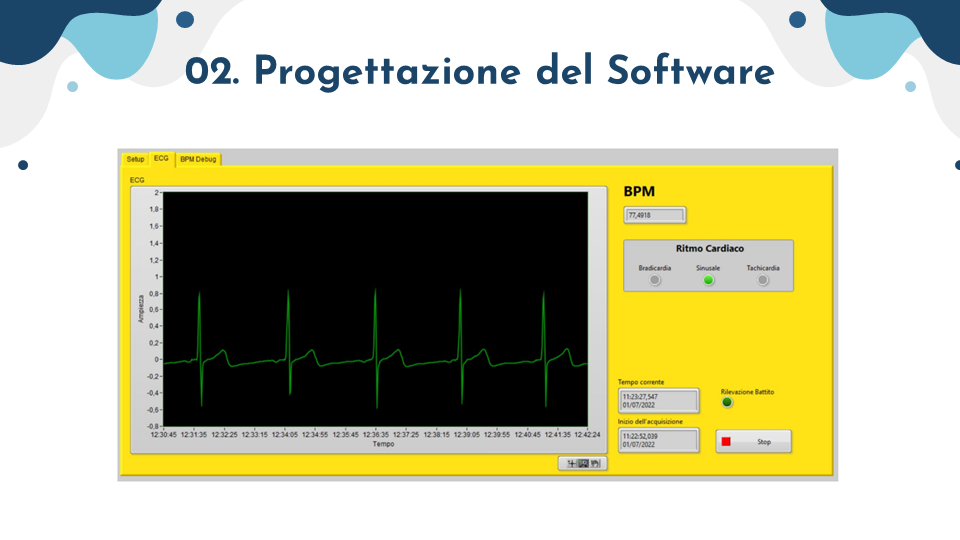
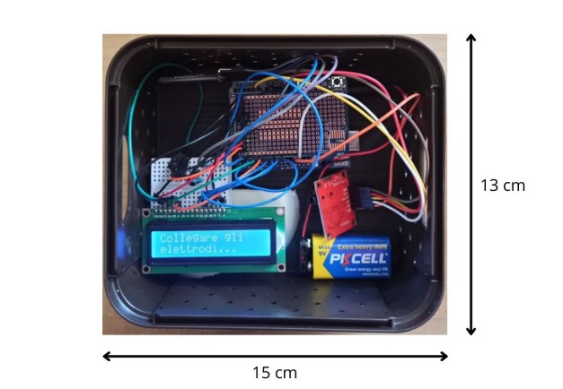

# Brief Project explanation
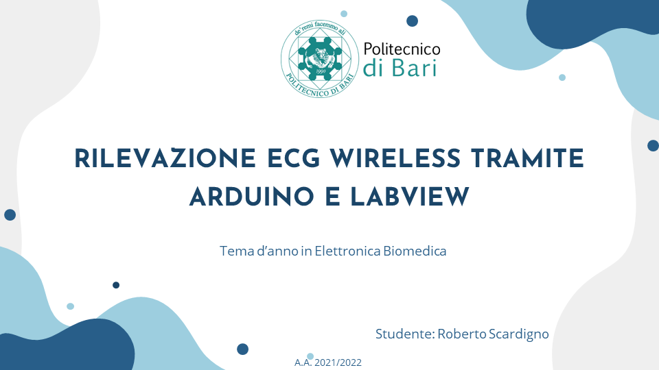
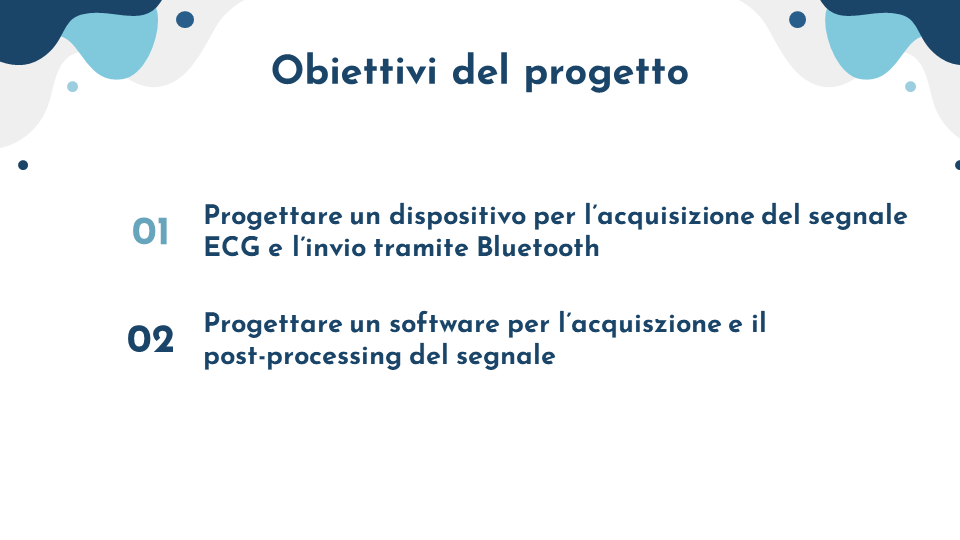

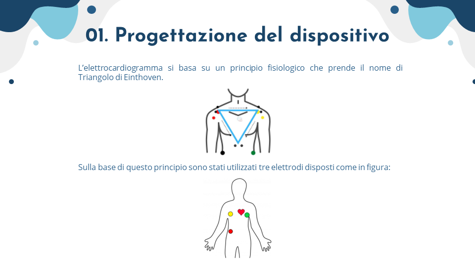
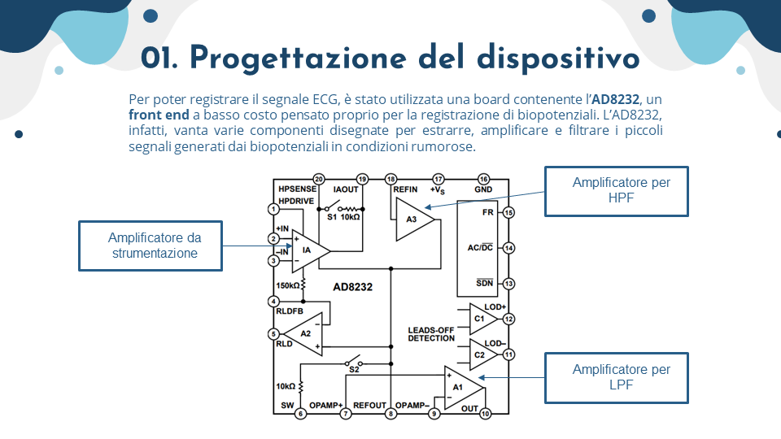
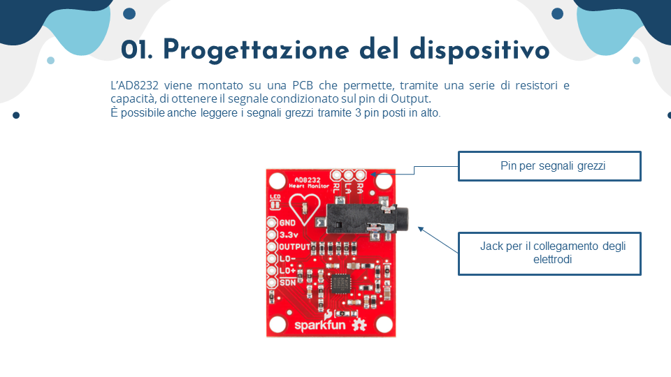
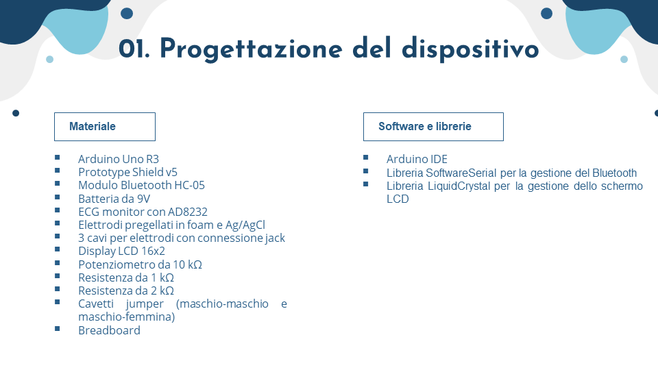
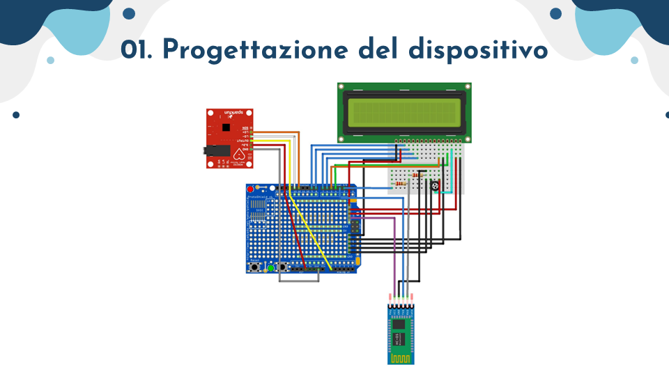
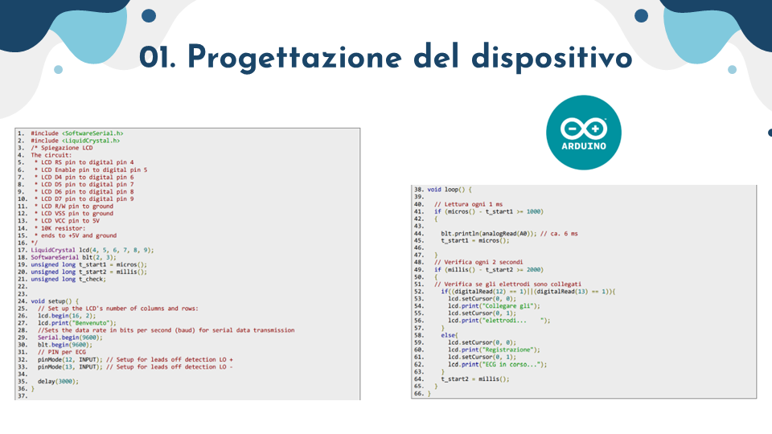

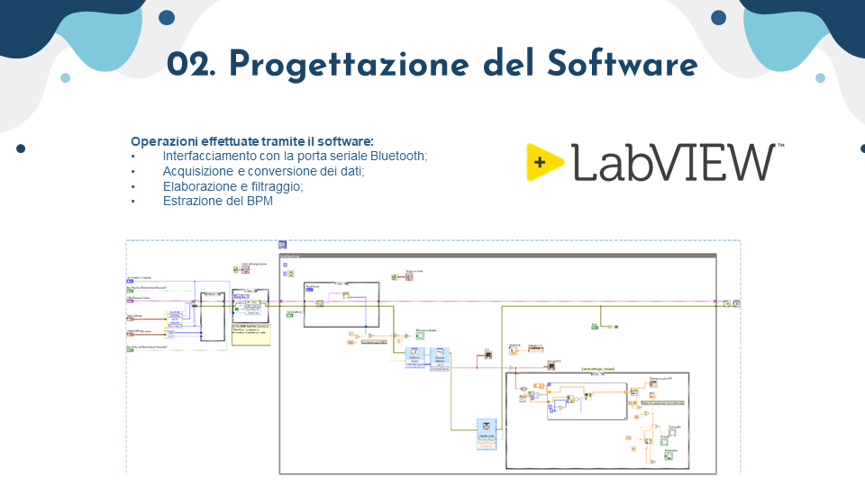

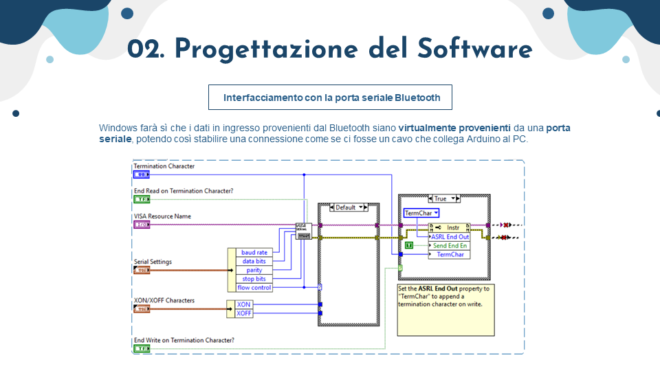
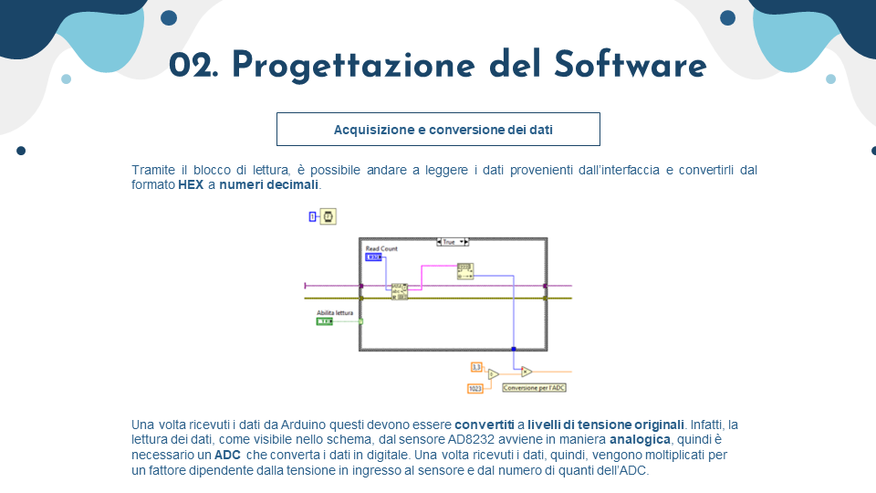
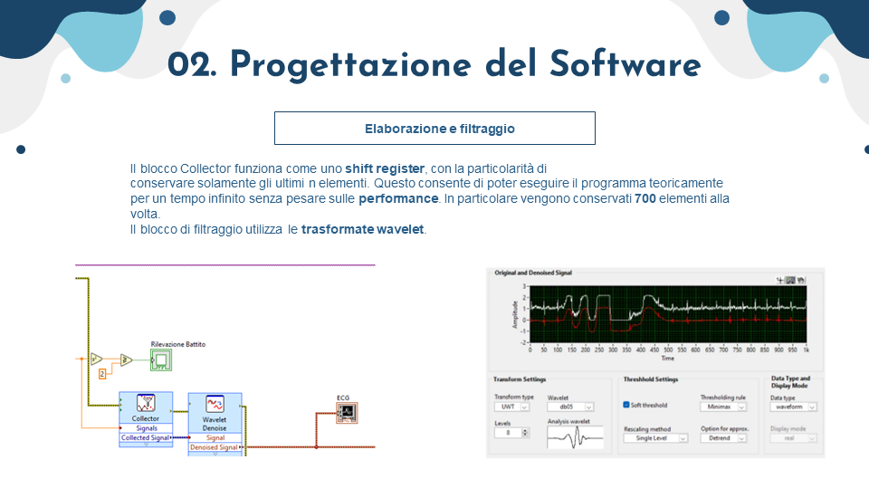
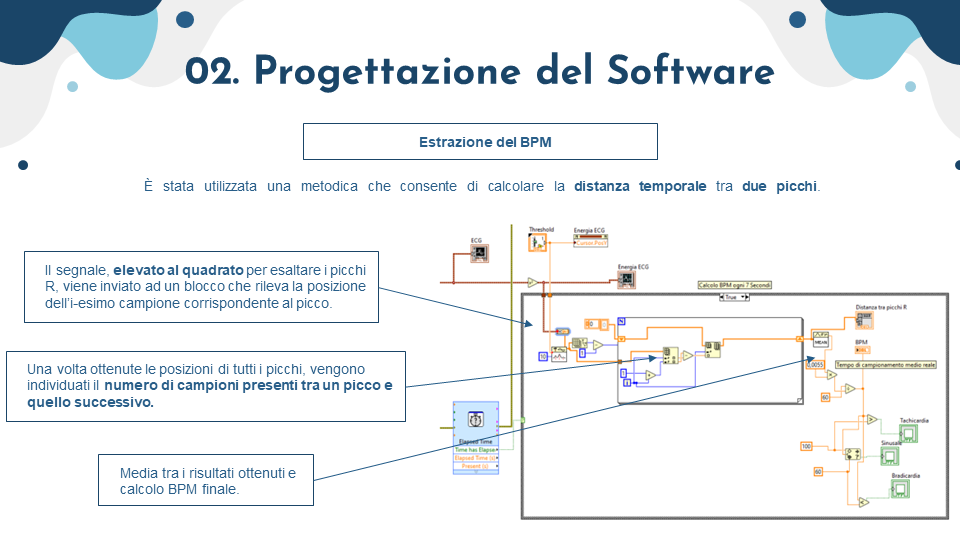
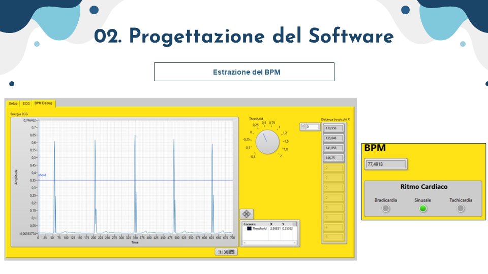

